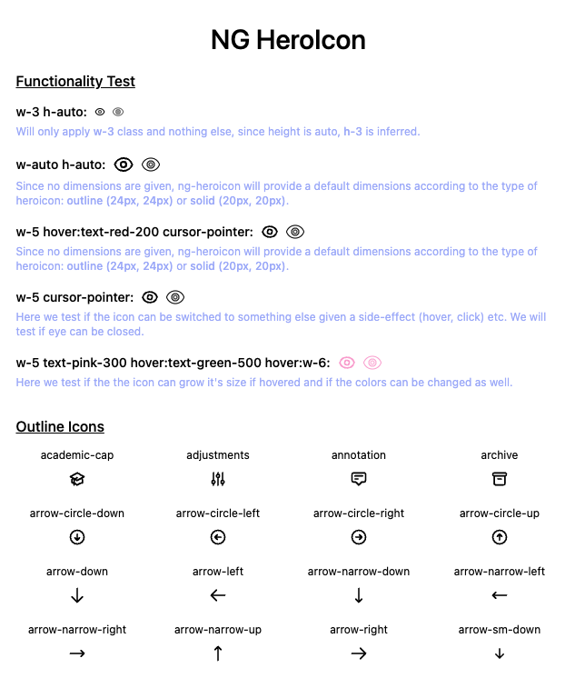

# NG Heroicon

A set of free MIT-licensed high-quality SVG icons for you to use in your web projects.

This project is a fork of https://github.com/tailwindlabs/heroicons which enables the use for Angular projects,
providing a component to display the heroicon.

This project uses some code ideas from https://github.com/ashley-hunter/ng-heroicons, fixing some stuff like enabling
passing class names for icon customization. It also fully works with TailwindCSS classes!

Preview and search at icons at https://www.heroicons.com

## Installing Library

```
npm install ng-heroicon
```

or

```
yarn add ng-heroicon
```

or

```
pnpm add ng-heroicon
```

## First steps

This library has been updated to **Angular 13** and also to include two global (and child module level)
options.

- `defaultHostDisplay` will determine which internal `display` class to use on host element (`<hero-icon />`), possible
  options are `block`, `inlineBlock` or `none` (default is `none`, which means this option is disabled).

- `attachDefaultDimensionsIfNoneFound` option is now introduced to try to figure out if the host element has any
  dimension (width or height), if nothing is found, it will provide a default dimension class for `outline` or `solid`
  icon. (default is `false`, which means this option is disabled)

For best experience I recommend `{ defaultHostDisplay: 'block', attachDefaultDimensionsIfNoneFound: true }`!

On root module:

```typescript
import {menu, HeroIconModule} from 'ng-heroicon';

@NgModule({
    imports: [
        HeroIconModule.forRoot({
            menu
        }, {
            defaultHostDisplay: 'inlineBlock', // default 'none'
            attachDefaultDimensionsIfNoneFound: true // default 'false'
        })
    ],
})
export class AppModule {
}
```

## On child modules

Call the module with `withIcons` function passing the wanted icons and optionally overriding the `options`, e.g.:

```typescript
import {annotation, menu, HeroIconModule} from 'ng-heroicon';

@NgModule({
    imports: [
        HeroIconModule.withIcons({
            annotation,
            menu
        }, {
            /**
             * Child level options.
             * Non passed options will use the rootModule options.
             */
            defaultHostDisplay: 'block',
        })
    ],
})
export class AppModule {
}
```

## Importing all icons in one go!

The library now exports a "allIcons" constant, you can import all icons like this:

```typescript
import {allIcons, HeroIconModule} from 'ng-heroicon';

@NgModule({
    imports: [
        HeroIconModule.withIcons({
            ...allIcons
        })
    ],
})
export class AppModule {
}
```

## On views

Use the component like this:

```html

<hero-icon name="annotation" hostDisplay="inlineBlock" type="outline" class="w-6 h-6"></hero-icon>
<hero-icon name="annotation" type="solid" class="w-4 h-4 text-gray-600 hover:text-gray-500"></hero-icon>
<hero-icon [name]="'menu'" [type]="'solid'" [class]="'w-4 h-4 text-red-900'"></hero-icon>
```

## Using the playground

1. Clone the repository `https://github.com/renatoaraujoc/heroicons`
2. Issue the command `npm install` to install all the project dependencies
3. Issue the command `npm run build-angular-icons` to build the library icons
4. Then `ng serve` to run the playground!


